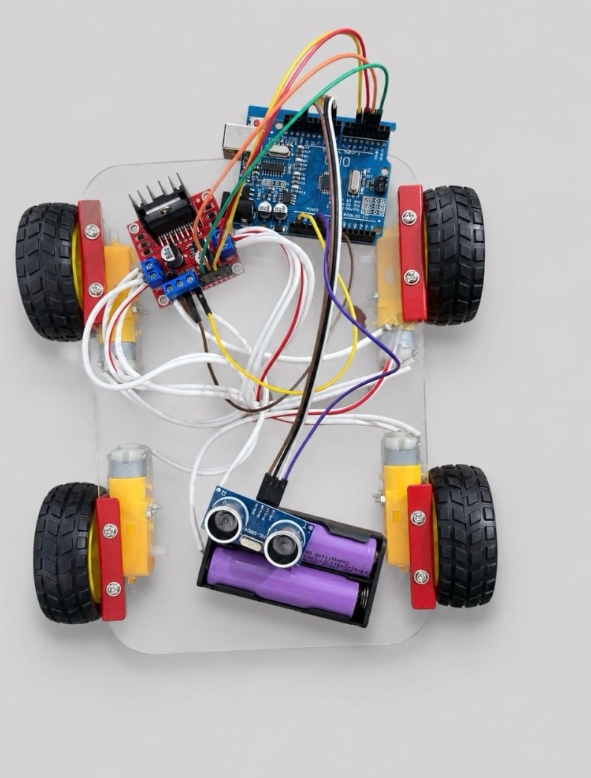

# Arduino-Based Obstacle Avoiding Robot

## Project Overview

This project is an autonomous obstacle-avoiding robot developed using Arduino Uno and ultrasonic sensing technology. The robot continuously monitors its surroundings and automatically changes its direction whenever an obstacle is detected within a predefined distance threshold.

The project was built during the first year of B.Tech Electronics and Communication Engineering (ECE) to gain practical experience in embedded systems, robotics, sensor interfacing, and motor control.

---

## Project Image

---

## Features

* Autonomous navigation
* Real-time obstacle detection
* Automatic direction control
* Four-wheel drive system
* Battery-powered operation
* Embedded C++ programming using Arduino IDE

---

## Hardware Components

| Component                 | Quantity |
| ------------------------- | -------- |
| Arduino Uno               | 1        |
| HC-SR04 Ultrasonic Sensor | 1        |
| L298N Motor Driver Module | 1        |
| DC Gear Motors            | 4        |
| Wheels                    | 4        |
| Lithium-Ion Battery Pack  | 1        |
| Chassis                   | 1        |
| Jumper Wires              | Multiple |

---

## Working Principle

1. The HC-SR04 ultrasonic sensor continuously measures the distance in front of the robot.
2. Arduino Uno processes the distance data.
3. If no obstacle is detected, the robot moves forward.
4. If an obstacle is detected within the threshold distance, the robot stops and changes direction.
5. The L298N motor driver controls the movement of all four DC motors.
6. The robot continues navigating autonomously while avoiding obstacles.

---

## Circuit Connections

### HC-SR04 to Arduino Uno

| HC-SR04 Pin | Arduino Pin |
| ----------- | ----------- |
| VCC         | 5V          |
| GND         | GND         |
| TRIG        | D9          |
| ECHO        | D10         |

### L298N to Arduino Uno

| L298N Pin | Arduino Pin |
| --------- | ----------- |
| IN1       | D2          |
| IN2       | D3          |
| IN3       | D4          |
| IN4       | D5          |

---

## Software Used

* Arduino IDE
* Embedded C++
* Arduino Core Libraries

---

## Algorithm

1. Initialize sensor and motor pins.
2. Measure distance using the ultrasonic sensor.
3. If distance is greater than 20 cm:

   * Move forward.
4. Otherwise:

   * Stop the robot.
   * Turn right.
   * Continue navigation.
5. Repeat continuously.

---

## Learning Outcomes

Through this project, I learned:

* Arduino Programming
* Embedded C++
* Sensor Interfacing
* Motor Driver Control
* Robotics Fundamentals
* Hardware Integration
* Circuit Design
* Debugging Embedded Systems

---

## Applications

* Autonomous Robots
* Educational Robotics
* Smart Navigation Systems
* Warehouse Automation
* Industrial Robotics

---

## Future Improvements

* ESP32 Integration
* Bluetooth Control
* Wi-Fi Monitoring
* Camera-Based Navigation
* AI-Based Obstacle Detection
* Hybrid Line Following and Obstacle Avoidance System

---

## Project Highlights

* Developed during the 1st Year of B.Tech ECE
* Built using Arduino Uno and HC-SR04 Ultrasonic Sensor
* Implemented autonomous obstacle detection and navigation
* Programmed using Embedded C++
* Demonstrated practical robotics and embedded systems concepts

---

## Author

**Mohammad Yazdaan  Wali Khan**

B.Tech Electronics and Communication Engineering (ECE)

Interests:

* Embedded Systems
* Robotics
* IoT
* Automation
* VLSI
